# Ideation Portal - Execution Plan

## Detailed Analysis Summary

### Project Scope
**Project Type**: Greenfield - New application development
**Primary Objective**: Build a digital platform for employee idea submission, evaluation, scoring, and recognition

### Transformation Scope
- **Scope Type**: New application (no existing codebase to transform)
- **Primary Changes**: Complete new platform with 6 major feature areas
- **Related Components**: Frontend (React), Backend (Python), Database (PostgreSQL)
- **Deployment Model**: Cloud-based (AWS/Azure/GCP)

### Change Impact Assessment
- **User-facing changes**: Yes - Complete new user interface for 4 user personas
- **Structural changes**: Yes - New system architecture with multiple components
- **Data model changes**: Yes - New database schema for ideas, evaluations, campaigns
- **API changes**: Yes - New REST API for all platform features
- **NFR impact**: Yes - Performance, security, scalability requirements

### Risk Assessment
- **Risk Level**: Medium
- **Rationale**: Greenfield project with clear requirements, but multiple interconnected features and real-time requirements
- **Rollback Complexity**: Easy (new system, no existing dependencies)
- **Testing Complexity**: Moderate (multiple user workflows, real-time features)

### Key Characteristics
- **Scale**: 500-5,000 employees, 10-50 ideas/month
- **Timeline**: Immediate launch (< 1 month)
- **Technology Stack**: Python (Django/FastAPI), React, PostgreSQL
- **Success Metric**: Implementation rate of top ideas

---

## Workflow Visualization

```mermaid
flowchart TD
    Start(["User Request"])
    
    subgraph INCEPTION["🔵 INCEPTION PHASE"]
        WD["Workspace Detection<br/><b>COMPLETED</b>"]
        RA["Requirements Analysis<br/><b>COMPLETED</b>"]
        US["User Stories<br/><b>COMPLETED</b>"]
        WP["Workflow Planning<br/><b>IN PROGRESS</b>"]
        AD["Application Design<br/><b>EXECUTE</b>"]
        UG["Units Generation<br/><b>EXECUTE</b>"]
    end
    
    subgraph CONSTRUCTION["🟢 CONSTRUCTION PHASE"]
        FD["Functional Design<br/><b>EXECUTE</b>"]
        NFRA["NFR Requirements<br/><b>EXECUTE</b>"]
        NFRD["NFR Design<br/><b>EXECUTE</b>"]
        ID["Infrastructure Design<br/><b>EXECUTE</b>"]
        CG["Code Generation<br/><b>EXECUTE</b>"]
        BT["Build and Test<br/><b>EXECUTE</b>"]
    end
    
    subgraph OPERATIONS["🟡 OPERATIONS PHASE"]
        OPS["Operations<br/><b>PLACEHOLDER</b>"]
    end
    
    Start --> WD
    WD --> RA
    RA --> US
    US --> WP
    WP --> AD
    AD --> UG
    UG --> FD
    FD --> NFRA
    NFRA --> NFRD
    NFRD --> ID
    ID --> CG
    CG --> BT
    BT --> OPS
    OPS --> End(["Complete"])
    
    style WD fill:#4CAF50,stroke:#1B5E20,stroke-width:3px,color:#fff
    style RA fill:#4CAF50,stroke:#1B5E20,stroke-width:3px,color:#fff
    style US fill:#4CAF50,stroke:#1B5E20,stroke-width:3px,color:#fff
    style WP fill:#FFA726,stroke:#E65100,stroke-width:3px,color:#000
    style AD fill:#FFA726,stroke:#E65100,stroke-width:3px,stroke-dasharray: 5 5,color:#000
    style UG fill:#FFA726,stroke:#E65100,stroke-width:3px,stroke-dasharray: 5 5,color:#000
    style FD fill:#FFA726,stroke:#E65100,stroke-width:3px,stroke-dasharray: 5 5,color:#000
    style NFRA fill:#FFA726,stroke:#E65100,stroke-width:3px,stroke-dasharray: 5 5,color:#000
    style NFRD fill:#FFA726,stroke:#E65100,stroke-width:3px,stroke-dasharray: 5 5,color:#000
    style ID fill:#FFA726,stroke:#E65100,stroke-width:3px,stroke-dasharray: 5 5,color:#000
    style CG fill:#4CAF50,stroke:#1B5E20,stroke-width:3px,color:#fff
    style BT fill:#4CAF50,stroke:#1B5E20,stroke-width:3px,color:#fff
    style OPS fill:#BDBDBD,stroke:#424242,stroke-width:2px,stroke-dasharray: 5 5,color:#000
    style INCEPTION fill:#BBDEFB,stroke:#1565C0,stroke-width:3px,color:#000
    style CONSTRUCTION fill:#C8E6C9,stroke:#2E7D32,stroke-width:3px,color:#000
    style OPERATIONS fill:#FFF59D,stroke:#F57F17,stroke-width:3px,color:#000
    style Start fill:#CE93D8,stroke:#6A1B9A,stroke-width:3px,color:#000
    style End fill:#CE93D8,stroke:#6A1B9A,stroke-width:3px,color:#000
    
    linkStyle default stroke:#333,stroke-width:2px
```

**Legend:**
- 🟢 Green (Completed/Always Execute): Workspace Detection, Requirements Analysis, User Stories, Code Generation, Build and Test
- 🟠 Orange (Conditional Execute): Application Design, Units Generation, Functional Design, NFR Requirements, NFR Design, Infrastructure Design
- ⚪ Gray (Skip/Placeholder): Operations Phase

---

## Phases to Execute

### 🔵 INCEPTION PHASE

#### ✅ Workspace Detection (COMPLETED)
- **Status**: Completed
- **Findings**: Greenfield project, no existing code
- **Output**: aidlc-state.md created

#### ✅ Requirements Analysis (COMPLETED)
- **Status**: Completed
- **Output**: requirements.md with 9 functional requirement categories, 7 non-functional requirement categories
- **Key Findings**: Medium complexity, multiple user personas, real-time requirements

#### ✅ User Stories (COMPLETED)
- **Status**: Completed
- **Output**: 4 personas, 22 main stories + 3 security stories organized into 6 epics
- **Key Findings**: Clear user workflows, well-defined acceptance criteria

#### 🔄 Workflow Planning (IN PROGRESS)
- **Status**: Creating execution plan
- **Output**: execution-plan.md (this document)

#### 📋 Application Design (EXECUTE)
- **Rationale**: New system requires high-level component identification and service layer design
- **Scope**: Define major components (Submission Service, Evaluation Service, Dashboard Service, Analytics Service, Recognition Service, Campaign Service), component methods, and dependencies
- **Deliverables**: components.md, component-methods.md, services.md, component-dependency.md
- **Complexity**: Medium - Multiple interconnected services with clear boundaries

#### 📋 Units Generation (EXECUTE)
- **Rationale**: Multiple services require decomposition into units of work for parallel development
- **Scope**: Decompose into 4-5 units of work based on service boundaries
- **Proposed Units**:
  1. **Unit 1: Idea Submission & Management** - Submission interface, draft saving, contributor management
  2. **Unit 2: Evaluation Framework** - Evaluation form, scoring, comment management
  3. **Unit 3: Dashboards & Leaderboards** - Real-time dashboard, leaderboard, comparative analysis
  4. **Unit 4: Analytics & Recognition** - Analytics dashboard, recognition system, reporting
  5. **Unit 5: Campaign Management** - Campaign creation, panel assignment, progress monitoring
- **Deliverables**: unit-of-work.md, unit-of-work-dependency.md, unit-of-work-story-map.md

### 🟢 CONSTRUCTION PHASE

#### 📋 Per-Unit Loop (EXECUTE for each unit)

For each of the 5 units above, execute:

##### Functional Design (EXECUTE)
- **Rationale**: Each unit has complex business logic requiring detailed design
- **Scope**: Business logic models, business rules, domain entities for each unit
- **Deliverables**: business-logic-model.md, business-rules.md, domain-entities.md (per unit)
- **Complexity**: Medium - Multiple business rules and workflows

##### NFR Requirements (EXECUTE)
- **Rationale**: Performance, security, and scalability requirements are critical
- **Scope**: Assess performance needs, security requirements, scalability concerns, tech stack decisions
- **Deliverables**: nfr-requirements.md, tech-stack-decisions.md (per unit)
- **Complexity**: Medium - Multiple NFR considerations

##### NFR Design (EXECUTE)
- **Rationale**: NFR patterns must be incorporated into design
- **Scope**: Design patterns for performance, security, scalability, monitoring
- **Deliverables**: nfr-design-patterns.md, logical-components.md (per unit)
- **Complexity**: Medium - Pattern selection and integration

##### Infrastructure Design (EXECUTE)
- **Rationale**: Cloud deployment requires infrastructure planning
- **Scope**: Map services to cloud resources, define deployment architecture
- **Deliverables**: infrastructure-design.md, deployment-architecture.md (per unit)
- **Complexity**: Medium - Cloud resource selection and configuration

##### Code Generation (EXECUTE - ALWAYS)
- **Rationale**: Implementation of all units required
- **Scope**: Generate code for all services, models, APIs, and frontend components
- **Deliverables**: Complete source code for each unit
- **Complexity**: High - Multiple components and integrations

#### ✅ Build and Test (EXECUTE - ALWAYS)
- **Rationale**: Build, test, and verification required for all units
- **Scope**: Build instructions, unit tests, integration tests, performance tests
- **Deliverables**: build-instructions.md, unit-test-instructions.md, integration-test-instructions.md, performance-test-instructions.md
- **Complexity**: Medium - Multiple test types and integration points

### 🟡 OPERATIONS PHASE

#### ⚪ Operations (PLACEHOLDER)
- **Status**: Placeholder for future deployment and monitoring workflows
- **Note**: Build and test activities handled in CONSTRUCTION phase

---

## Execution Summary

### Stages to Execute (11 total)

**INCEPTION PHASE (6 stages):**
1. ✅ Workspace Detection (COMPLETED)
2. ✅ Requirements Analysis (COMPLETED)
3. ✅ User Stories (COMPLETED)
4. 🔄 Workflow Planning (IN PROGRESS)
5. 📋 Application Design (EXECUTE)
6. 📋 Units Generation (EXECUTE)

**CONSTRUCTION PHASE (5 stages):**
7. 📋 Functional Design (EXECUTE - per unit)
8. 📋 NFR Requirements (EXECUTE - per unit)
9. 📋 NFR Design (EXECUTE - per unit)
10. 📋 Infrastructure Design (EXECUTE - per unit)
11. ✅ Code Generation (EXECUTE - ALWAYS)
12. ✅ Build and Test (EXECUTE - ALWAYS)

### Stages to Skip (0 total)
None - All stages add value for this greenfield project

### Parallel Development Opportunities

**Units can be developed in parallel:**
- Unit 1 (Submission) and Unit 2 (Evaluation) can start simultaneously
- Unit 3 (Dashboards) depends on Units 1 & 2 completion
- Unit 4 (Analytics) depends on Unit 2 completion
- Unit 5 (Campaign Management) can start independently

**Recommended Sequence:**
1. Start Units 1, 2, 5 in parallel (independent)
2. Start Unit 3 after Units 1 & 2 complete
3. Start Unit 4 after Unit 2 completes
4. Integration testing after all units complete

---

## Estimated Timeline

### Phase Breakdown
- **INCEPTION Phase**: 1-2 days
  - Workspace Detection: 0.5 hours (completed)
  - Requirements Analysis: 2 hours (completed)
  - User Stories: 4 hours (completed)
  - Workflow Planning: 1 hour (in progress)
  - Application Design: 4 hours
  - Units Generation: 2 hours

- **CONSTRUCTION Phase**: 3-4 weeks
  - Per-Unit Design (5 units × 3 days): 15 days
  - Code Generation (5 units × 4 days): 20 days
  - Build and Test: 5 days
  - Integration and refinement: 5 days

- **Total Estimated Duration**: 3.5-4.5 weeks

### Critical Path
1. Application Design (blocks Units Generation)
2. Units Generation (blocks all unit work)
3. Parallel unit development (5 units in parallel)
4. Integration testing (after all units)

---

## Success Criteria

### Primary Goals
1. **Functional Completeness**: All 22 user stories implemented
2. **Quality**: 80%+ test coverage, all acceptance criteria met
3. **Performance**: Dashboard loads in 2 seconds, real-time updates within 5 seconds
4. **Security**: Role-based access control, audit logging, encryption
5. **Timeline**: Launch within 1 month

### Key Deliverables
1. Complete source code for all 5 units
2. Comprehensive test suite (unit, integration, performance)
3. Build and deployment instructions
4. API documentation
5. User documentation
6. Deployment artifacts (Docker, Kubernetes configs)

### Quality Gates
- [ ] All user stories have passing acceptance criteria
- [ ] Code coverage ≥ 80%
- [ ] Performance tests pass (dashboard < 2 seconds)
- [ ] Security tests pass (OWASP Top 10)
- [ ] Integration tests pass (all units working together)
- [ ] Build succeeds without errors
- [ ] Deployment instructions verified

---

## Next Steps

1. **Review this execution plan** - Verify phases and units align with your vision
2. **Approve or request changes** - Modify if needed
3. **Proceed to Application Design** - Define system components and architecture
4. **Execute Units Generation** - Decompose into units of work
5. **Begin Construction Phase** - Design and implement each unit

---

## Notes

- **Greenfield Advantage**: No existing code to maintain or migrate, allowing clean architecture
- **Parallel Development**: 5 units can be developed in parallel with proper coordination
- **Real-Time Requirements**: Dashboard and leaderboard real-time updates require careful implementation
- **Security Focus**: Role-based access control and audit logging are critical
- **Scalability**: Design must support growth from 500 to 5,000+ employees
